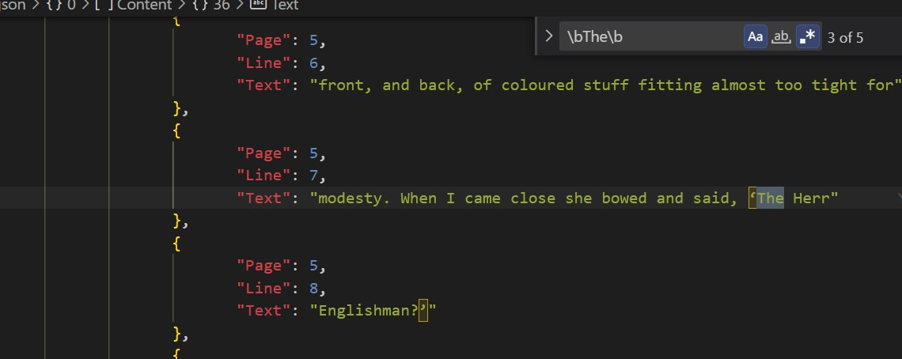

<!-- TODO: Convert this to pdf later -->
# My Process
## Setup:
- To begin, I forked the repo and cloned that fork into VSCode. In a real-life engineering setting, I would plan to make a pull request to the original repository, though that seems unnecessary for this challenge.
- In VSCode, I ran the tester.html locally to test the base code. I opened the js console using F12 in my browser, Brave (i.e. Chrome but with more privacy), to see the .js file's output.
- I looked through tester.html, and noticed that the main js script was located in the "head" element. I immediately moved this script to the bottom of the HTML, as it's best practice to run scripts at the end of the file since scripts block HTML from rendering.
- I then began my assessment of the overall problem.
## Problem Assessment:
- I always begin these problems by clearly establishing Parameters, Returns, and Examples (i.e. unit tests).

##### Parameters:
- @param {string} searchTerm - The word or term we're searching for. 
    - NOTE: search algorithm is case sensitive.
    - NOTE: There exists a possible edge case where searchTerm is NOT a string, e.g. an int, null, or undefined

- @param {JSON} scannedTextObj - A JSON object representing the scanned text:
```
scannedTextObj = 
    [ 
        {title, ISBN, // book = object
            content = [     // content = array of lines of text in the book
                {page,line,text},
                {page,line,text},
                ... // EDGE CASE: A book might have an empty content array!
            ]
        },
        ...  // EDGE CASE: there could be 0 books in the scannedTextObj!
    ]
```
- We are told that "content" might be empty for some or all books, and that there may be no book objects, to begin with.
- I  took note of all of these cases in code comments to make sure I would account for them in future unit tests.
- I also made a note to make one or two JSON examples using at least one other book, that I'd put in a separate file(s) so as not to bloat book_search.js

##### Returns:
- @returns {JSON} - Search results.
    - Format (relative to parameters and their attributes):
    ```
    searchResults = 
    {
        "SearchTerm": searchTerm,
        "Results": [
            {
                "ISBN": scannedTextObj.ISBN (string),
                "Page": scannedTextObj.content.page (integer, first instance where searchTerm was found),
                "Line": scannedTextObj.content.line (integer, first instance... etc) 
            },
            {
                "ISBN": scannedTextObj.ISBN (string),
                "Page": scannedTextObj.content.page (integer, second instance where searchTerm was found),
                "Line": scannedTextObj.content.line (integer, second instance... etc) 
            },
            ... //EDGE CASE: If searchTerm is never found, Results will be an empty array. i.e. []
        ]
    }

- It's stated that we'll always return a JSON that's at least: ```{ "SearchTerm": (string), "Results": [] }```. 
- For the sake of having clean results, I decided to make that lines that have more than one instance of the searchTerm appear only once in the result JSON.


##### Examples:

- The examples/unit tests are the least defined piece of this problem, therefore we should make sure our examples cover as many different cases as possible.

- Possible Cases:

    - We pass in a scannedTextObj containing only one book:
        - Contains the searchTerm
        - Does not contain the searchTerm
        - Does not contain a searchTerm in a different case (i.e. "the" vs "The")


    - We pass in a scannedTextObj containing multiple books, where:
        - Neither book contains the "searchTerm"
        - Where only one book contains the "searchTerm"
        - All books contain the "searchTerm"

    - EDGE CASES:
        - scannedTextObj = [], i.e. empty, so return empty results
        - scannedTextObj has one book with an empty content field, so return empty results
        - scannedTextObj contains the wrong variables types, so catch an error but continue to allow more tests to run
        - scannedTextObj has many books all with empty content fields, so return empty results

    - There may be other examples outside of what I've listed here, but for the sake of completing the challenge in a timely manner, I decided to move on to implementing my solution.

## Initial Implementation:

- Made "result" a let instead of var to prevent scope errors that tend to be inherent to var.

- I started by simply trying to implement the functionality of finding the given search term, "the", in the JSON input before anything else.

- I began by establishing the JSON structure of the object we would return based on the given specifications.

- Since the input JSON, scannedTextObj, has a nested structure, I used a nested for loop to iterate over every "line" of every "book" in scannedTextObj.

- I then matched the searchTerm to each line in scannedTextObj by using a regex that searches for the searchTerm surrounded by a "word border" (i.e. a space, newline, period, etc) on both sides. By utilizing regex, I was able to get consistent and accurate results.

- I used regex since searching for the word "the" in a book would cause the function to return lines containing the word "they" but not containing the word "the" as well. 

- I implemented regex word boundaries to prevent this error - I verified my results were correct by ctrl+f'ing the terms as regex in each json (see image for example)



- If a match was found, the line and its corresponding data (as specified in the challenge document) would be pushed to the result JSON.

- After the loop(s) through scannedTextObj completes, it returned the results JSON

- To my best understanding, this has a time complexity of O(n) since the number of operations performed in this function is directly proportional to the size of the input JSON, scannedTextObject. I believe the memory complexity would also be O(n) (or perhaps O(2*n) if you want to get really specific) since the algorithm would produce another JSON around the size of the original JSON in the worst case.

- I tested my function using positive, negative, and case tests against the given JSON excerpt from 20,000 Leagues Under the Sea (great choice by the way), and it worked!

- I refactored the unit tests to be performed in the format I'm used to, with multiple calls being performed on a helper function that should all return "true" in order to pass all the tests. This would reduce code redundancy.

- I then decided to expand the scope of these tests.
## Converting Another Book into JSON

- I decided to take a copy of another public domain book, Bram Stoker's Dracula, and convert a few of its pages into a JSON.

- I found a publicly available .txt file of Dracula that's licensed for free use by the public. I took a large block of text and saved it as "dracula.txt".

- I then compared "dracula.txt" to a real copy of Dracula to see where the page cutoffs were, and added a ":::" in the .txt file as points where a python script could split the book.

- I wrote an ad hoc/brute force algorithm that would take dracula.txt and morph it into a JSON-like format. The result printed out in dracula_lines.txt

- For the sake of time, I didn't make my python algorithm thorough, since doing so isn't required to fulfill the challenge, and opted to manually format some small errors that printed to dracula_lines.txt.

- I then copied and pasted the corrected txt into dracula.json, where I used VSCode's auto-format command, Alt+Shift+F, to automatically format the txt with the correct JSON tab spacing.

- I could then proceed with performing tests on Dracula.

## More Tests for More Books (and Edge Cases!)

- I chose to search for some words I knew I would or would not find in the book Dracula: "The", "Vampire", "Dracula", "dracula" (Dracula is a name, so it's always capitalized), and "Mina" (One of the main characters in the novel).

- I console.log'd the results from various runs of the search function on dracula.json, and verified that the results were correct by searching how many times the word appeared in the JSON manually. 

- I also created a JSON that combined the contents of the original 20,000 Leagues example JSON and dracula.json, which I named multipleBooks.json, and performed similar console.log tests.

- I then created more test cases based on these console.logs, and implemented them into my code.

- I then added some edge cases regarding empty arrays, empty field values, and missing fields.

- I added a try/catch to findSearchTermInBooks(), which would account for the rare case where an input object contains an invalid value/variable type.

## Wrap Up

- I like to be thorough on how these problems should be solved, so I emailed the USDC with the questions below, and waited to hear back before submitting my code:
    - Should we account for cases in which searchTerm is NOT a string, e.g. is null, undefined, or any native js type that's not a string?
    - Should we ALWAYS expect scannedTextObj to:
        - A. always be a JSON in this format with these exact keys and value-types
        - B. should we account for edge cases if A. is not true?
    - Even if the question may be trivial, I will ask if there's any time we might need to return something unexpected.
    - If the examples that I've come up with were to pass, would you be satisfied saying that I've solved the problem?

- I heard back, and they said they weren't allowed tell me anything. Given that this challenge is meant to be completed in around 2 hours, I reckon that they're not looking for anything insanely robust, e.g. O(1) execution on a JSON containing thousands of lines. As such, I decided that the work I've done is likely to satisfy the requirements of the challenge.